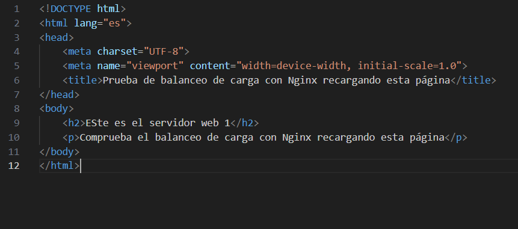
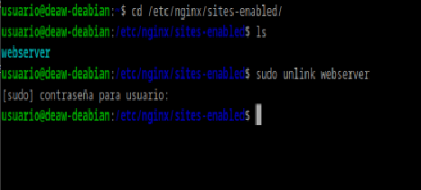
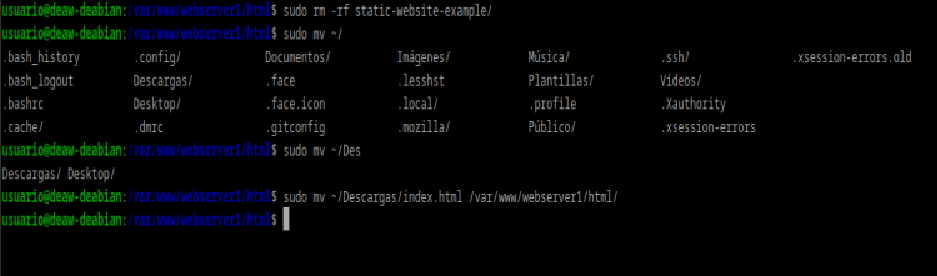
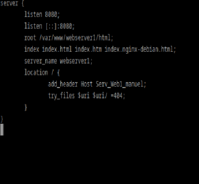
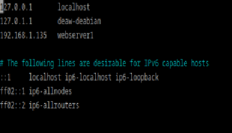
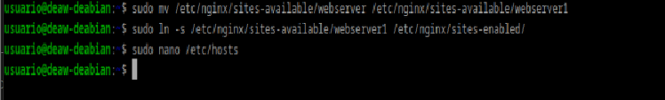
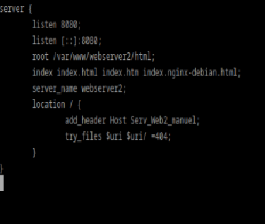
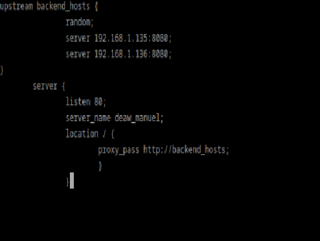
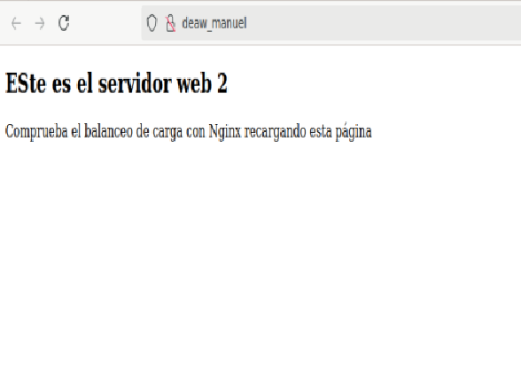
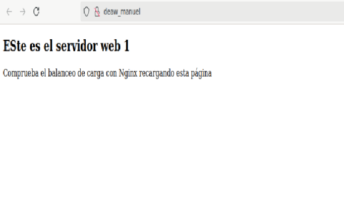

# Práctica 2.4: Proxy inverso con balanceo de carga con Nginx

En primer lugar, como siempre, nos aseguramos de que la práctica anterior funciona correctamente. Entonces podemos comenzar.

## Configuración Nginx Web Server 1

En primer lugar crearemos el siguiente archivo index.html el cuál añadiremos el directorio de nuestro servidor:



Primero nos aseguramos de desenlazar el antiguo archivo de configuranción de sites-enabled:



Eliminamos el contenido anterior de la carpeta e introducimos el nuevo index.html:



A continuación realizamos los cambios oportunos en el archivo de configuración y añadimos la cabecera siguiente:



Modificamos el archivo /etc/hosts : 


Y creamos el enlace simbólico de nuevo: 


## Configuración Nginx Web Server 2

En general haremos los mismos cambios que en la máquina anterior solo que poniendo webserver2 en su lugar. El archivo de configuración quedará de la siguiente forma: 



## Configuración Nginx Proxy Inverso

Creamos un nuevo archivo en el directorio de sites-available llamado balance que contendrá lo siguiente: 



## Comprobación

Abriremos el navegador y desactivaremos el uso de caché.
Y refrescaremos la págna con lo cual comprobaremos que está cambiando aleatoriamente de servidor, como podemos ver a continuación:





## Cuestiones

### Cuestión 1
```
Busca información de qué otros métodos de balanceo se pueden aplicar con Nginx y describe al menos 3 de ellos.
```
Los más comunes son:
- Round Robin
- Least Connections
- IP Hash

### Cuestión 2
```
Si quiero añadir 2 servidores web más al balanceo de carga, describe detalladamente qué configuración habría que añadir y dónde.
```
Habría que añadirlos a nuestro archivo de configuración de balanceo en el servidor de proxy. Añadiendo las 2 nuevas ips a backend_hosts.


### Cuestión 3
```
Describe todos los pasos que deberíamos seguir y configurar para realizar el balanceo de carga con una de las webs de prácticas anteriores.

Indicad la configuración de todas las máquinas (webservers, proxy...) y de sus servicios
```